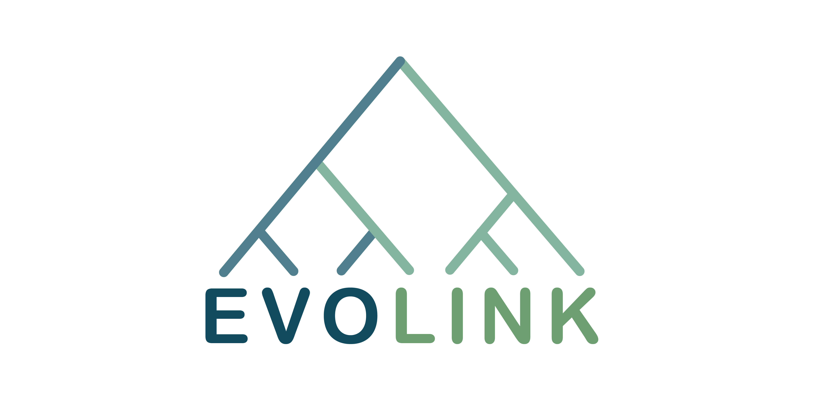

# Evolink

**Evolink** is a phylogenetic approach for rapid identification of genotype-phenotype associations in large-scale microbial multi-species data.

# Document

A detailed document is provided here: [Evolink pages](https://nlm-irp-jianglab.github.io/Evolink).
