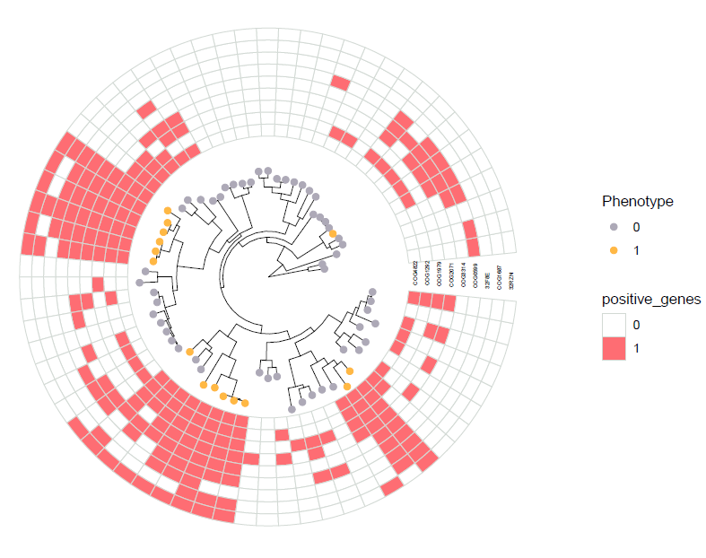
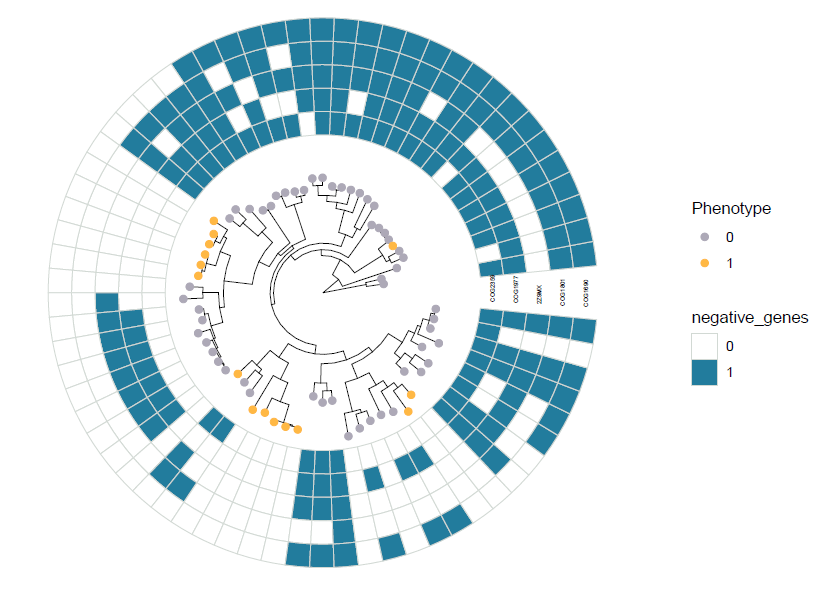
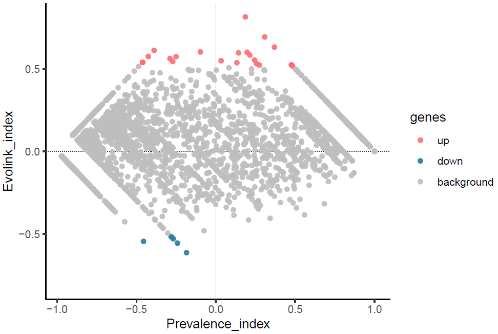
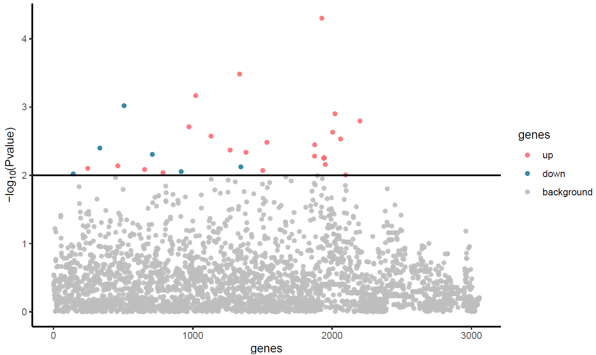

# Welcome to Evolink

## Overview
---
In breif, Evolink is a phylogeny-based tool to detect genes (both positively and negatively associated ones) contributed to a phenotype present in multi-species (e.g. resistance, virulence, host and colony).

Identification of genotype-phenotype associations is a fundamental task not only in microbiology but also in the whole field of biology. Yet as microbial data is rapidly increasing, the scales of gene family pool (~10^6) and phylogenetic tree (with > 10^5 leaves) make current methods less efficient to link genes to traits. 

Phylogenetic information is accepted as a good resource to control for population structure in microbial genotype-phenotype association analyses and avoid spurious findings. That's why Evolink was developed based on the use of phylogeny.

Tested on a flagella dataset with a large tree (with 1,948 leaves) and a gene family presence/absence matrix (containing 149,316 gene families), Evolink could give results in less than 5 minutes, demonstrating its capability of mining genes correlated to a phenotype on large-scale datasets.

## Requirement
---
- Install [Anaconda](https://www.anaconda.com/products/distribution) or [Miniconda](https://docs.conda.io/en/latest/miniconda.html) -- A distribution of the Python and R programming languages for scientific computing, greatly simplifying package management and deployment.
- [Anaconda or Miniconda?](https://docs.conda.io/projects/conda/en/latest/user-guide/install/download.html#anaconda-or-miniconda)

## Installation
---
To install Evolink is easy.
- Step 1. Git clone project  
`git clone https://github.com/nlm-irp-jianglab/Evolink.git`  
`cd Evolink`

- Step 2. Build conda environment  
`conda env create -f environment.yml`

- Step 3. Activate Evolink environment  
`conda activate Evolink`

- Step 4. Setup R packages  
`Rscript setup.R`

## Input
---
Evolink takes 3 essential input files:
1) Species tree (newick format). It is recommended that the tree is rooted. Internal node names are not necessary. For example:  

``` (species_1:1,(species_2:1,(species_3:1,species_4:1)Internal_1:0.5)Internal_2:0.5)Root:0.1; ```

2) Trait/Phenotype binary file (tab separated file). The header is a must and should be "Tip" and "Status". Tip column contains the tip names the same as the tree, while Status column contains the presence (1) and absence (0) of the phenotype for each leaf. So far only 1 or 0 is accepted and all leaves should be labeled with a 0/1 status. For example:  

| Tip       | Status |
|-----------|--------|
| species_1 | 0      |
| species_2 | 1      |
| species_3 | 1      |
| species_4 | 0      |


3) Gene presence/absence matrix file (tab separated file). Each row is the binary (0/1) status of each gene across all species. Each gene should appear in a species for at least one time. The first colname could be any word, but "orthoID" (orthogroup ID) is a nice choice to be shown here. For example:  

| orthoID | species_1 | species_2 | species_3 | species_4 |
|---------|-----------|-----------|-----------|-----------|
| gene_1  | 0         | 1         | 1         | 0         |
| gene_2  | 1         | 1         | 0         | 0         |
| gene_3  | 1         | 0         | 1         | 0         |
| gene_4  | 0         | 1         | 0         | 1         |


## Usage
---
```
usage: Evolink.py [-h] -g GENE_TABLE -t TRAIT_TABLE -n TREE [-c] [-a ALPHA] [-p THRESHOLD] [-e THRESHOLD] [-s PERM_TIMES] [-@ THREADS] [-r SEED]
                  [-b PERMUTATION_ALPHA] [-v] [-N TOP_GENES] [-d {1,2}] [-f] -o OUTPUT

Evolink is designed to find gene families associated with trait by explicitly using phylogeny information.

optional arguments:
  -h, --help            show this help message and exit
  -g GENE_TABLE, --genotype GENE_TABLE
                        Tab-delimited gene presence/absence or copy number table. 
                        Columns are gene families, while rows are tip 
                        names/species/genomes in the phylogenetic tree. If copy 
                        number table is provided, please use -c option so that it 
                        will be internally converted to binary
                        table. Presence=1, Absence=0.
  -t TRAIT_TABLE, --phenotype TRAIT_TABLE
                        Two-column (so far only one trait is allowed each time) 
                        tab-delimited trait presence/absence table. The first column 
                        is tip names and the second column is the presence/absence 
                        of this trait on the tips/species/genomes. 
                        Presence=1, Absence=0.
  -n TREE, --phylogeny TREE
                        A phylogentic tree in newick format. The tip names should 
                        be the same in the gene table and trait table.
  -c, --copy_number     The given gene table stores numbers (e.g. gene copy numbers) 
                        instead of presence/absence binary values. [Default: True]
  -a ALPHA, --alpha ALPHA
                        Pvalue threshold [Default:0.01]
  -p THRESHOLD, --p_threshold THRESHOLD
                        Absolute Prevalence index threshold to filter genes and 
                        get Evolink index distribution [Range: 0-1; Default: 0.9]
  -e THRESHOLD, --e_threshold THRESHOLD
                        Absolute Evolink index threshold to select significant genes. 
                        Notice: P-value cutoff (alpha) will be updated based 
                        on this option [Range: 0-1; Default: NULL]
  -s PERM_TIMES, --simulation_times PERM_TIMES
                        Need to permutation test and set the simulation times 
                        [Range: 0-10000]. Default is 0 and no permutation is performed.
  -@ THREADS, --threads THREADS
                        Threads for permutation test [Default: 4]
  -r SEED, --seed SEED  Set seed for simulation for reproducibility of the results 
                        [Default: 1]
  -b PERMUTATION_ALPHA, --permutation_alpha PERMUTATION_ALPHA
                        Permutation pvalue threshold [Default:0.01]
  -v, --visualization   Whether to generate plots
  -N TOP_GENES, --top_genes TOP_GENES
                        Top positively and negatively associated genes mapped to tree. 
                        [Default: 5,5 for top 5 pos genes and top 5 neg genes.]
  -d {1,2}, --display-mode {1,2}
                        Tree display mode. [1: circular, 2: rectangular; Default: 1]
  -f, --force           Force to overwrite output folder. [Default: False]
  -o OUTPUT, --output OUTPUT
                        output directory
```

## Examples
---
1. With binary gene presence/absence table and no plots by default (the most common usage):
```
python Evolink.py -g test/gene.tsv -t test/trait.tsv -n test/tree.nwk -o output_dir
```

2. With gene copy number table (add "-c" option):
```
python Evolink.py -g test/gene_CN.tsv -c -t test/trait.tsv -n test/tree.nwk -o output_dir_CN
```

3. Enable plot function (add "-v" option. To save time, Evolink will not generate figures by default):
```
python Evolink.py -g test/gene.tsv -c -t test/trait.tsv -n test/tree.nwk -o output_dir -v
```

4. "-N" is to map top nine positively and top eight negatively associated genes in the plot; "-d" is to use circular layout for the tree; "-f" is to force overwrite the output directory if it already exists; "-e" is to custom set a thershold for Evolink_index and pvalue cutoff (alpha) will be calculated accordingly:
```
python Evolink.py -g test/gene.tsv -c -t test/trait.tsv -n test/tree.nwk -o output_dir -f -v -N 9,8 -d 1 -e 0.48
```

5. "-s" is to perform permutation test and set permutation times=1000; "-@" is to use 8 threads to speed up the permutation:
```
python Evolink.py -g test/gene.tsv -c -t test/trait.tsv -n test/tree.nwk -o output_dir -f -s 1000 -@ 8
```

## Output
---
A basic output file from Evolink is named "result.tsv" in the output directory provided by the user. It includes "Evolink_index", "Prevelance_index", "significance" and "z_score".  "Evolink_index" and "significance" are the most useful values. For example:  

| orthoID | Prevalence_index | Evolink_index | pvalue  | significance |
|---------|------------------|---------------|---------|--------------|
| COG1222 | -0.01554         | 0.28832       | 0.11089 | NA           |
| COG0436 | 1.00000          | 0.00000       | NA      | NA           |
| COG3635 | -0.28304         | -0.51392      | 0.00949 | sig          |
| COG0546 | 0.81832          | 0.18168       | 0.28819 | NA           |
| COG1797 | 0.47592          | 0.52408       | 0.00785 | sig          |
| COG0017 | -0.21711         | -0.20687      | 0.23454 | NA           |
| COG0574 | 0.94472          | 0.05528       | NA      | NA           |

If pemutation test is performed, an additional column named "permutation_pvalue" will be provided. 

When enabling the plot function (with -v or --visualization option), Evolink provides in the output directory four types of figures (see example outputs [here](https://github.com/nlm-irp-jianglab/Evolink/tree/main/test/output_dir) and [here](https://github.com/nlm-irp-jianglab/Evolink/tree/main/test/output_perm_dir)):

#### 1) iTOL website input
A tree file (input.tree) and annotation file (binary.txt) as well as a zipped file called **Evolink_itol_input.zip** are provided for users to visualize their results on the [Tree of Life (iTOL)](https://itol.embl.de/).  
a) You can simply upload the **input.tree** to iTOL website and drag **binary.txt** onto the webpage for visualization.  
b) Or if you have a iTOL subscription API key and have installed [iTOL API](https://github.com/iBiology/iTOL), you can use the following command line to upload and annotate your tree.  
`itol Evolink_itol_input.zip -i <your iTOL upload API key> -p <project_name>`

#### 2) ggtree plot for positively and negatively associated genes
**Tree_mapping_pos.pdf**

**Tree_mapping_neg.pdf**


#### 3) Evolink plot
**Evolink.pdf**


#### 4) Manhattan plot
**Manhattan.pdf**


In addition, we also provided a script "Evolink_plot.R" to individually generate local figures after you get the result from Evolink (i.e. result.tsv):  
```Rscript --vanilla Evolink_plot.R -g test/gene.tsv -t test/trait.tsv -n test/tree.nwk -r test/output_dir/result.tsv -o test/plot_dir```
