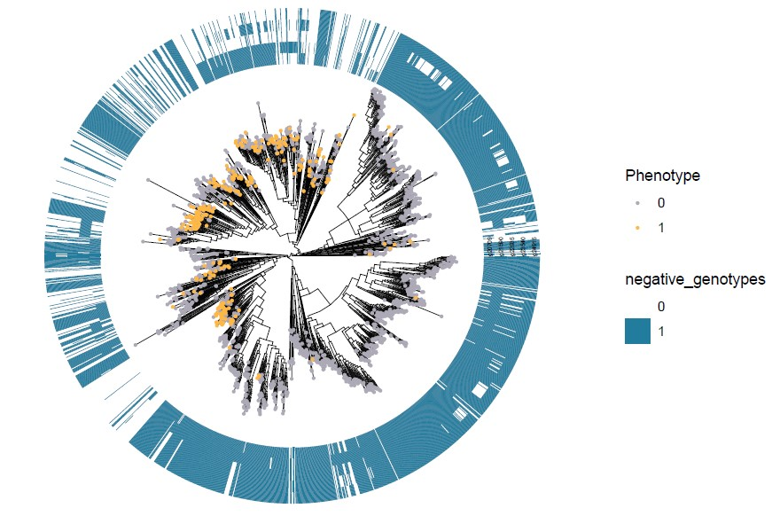
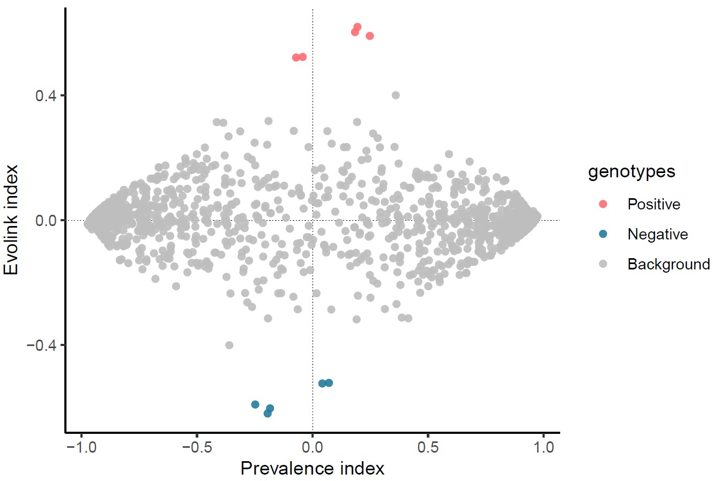

# Welcome to Evolink

## Overview
---
In breif, Evolink is a phylogeny-based tool to detect genotypes (both positively and negatively associated ones) contributed to a phenotype present in multi-species (e.g. resistance, virulence, host and colony).

Identification of genotype-phenotype associations is a fundamental task not only in microbiology but also in the whole field of biology. Yet as microbial data is rapidly increasing, the scales of gene family pool (~10^6) and phylogenetic tree (with > 10^5 leaves) make current methods less efficient to link genotypes to traits. 

Phylogenetic information is accepted as a good resource to control for population structure in microbial genotype-phenotype association analyses and avoid spurious findings. That's why Evolink was developed based on the use of phylogeny.

Tested on a flagella dataset with a large tree (with 1,948 leaves) and a gene family presence/absence matrix (containing 149,316 gene families), Evolink could give results in less than 5 minutes, demonstrating its capability of mining genotypes correlated to a phenotype on large-scale datasets.

## Installation
---
To install Evolink is easy and you have three choices.

### Use Conda
- Install [Anaconda](https://www.anaconda.com/products/distribution) or [Miniconda](https://docs.conda.io/en/latest/miniconda.html) first. They are distributions of the Python and R programming languages for scientific computing, greatly simplifying package management and deployment.
- [Anaconda or Miniconda?](https://docs.conda.io/projects/conda/en/latest/user-guide/install/download.html#anaconda-or-miniconda)

- Step 1. Git clone project  
`git clone https://github.com/nlm-irp-jianglab/Evolink.git`  
`cd Evolink`

- Step 2. Build conda environment  
`conda env create -f environment.yml`

- Step 3. Activate Evolink environment  
`conda activate Evolink`

- Step 4. Setup required R packages
`Rscript setup.R`

### Use Mamba
To expereince a much faster installation:
Please install [mamba](https://mamba.readthedocs.io/en/latest/installation.html) first.
If you use Linux, install mamba is very easy:
`wget "https://github.com/conda-forge/miniforge/releases/latest/download/Mambaforge-$(uname)-$(uname -m).sh`
`bash Mambaforge-$(uname)-$(uname -m).sh`

The installation is very similar to using conda.
- Step 1. Git clone project  
`git clone https://github.com/nlm-irp-jianglab/Evolink.git`  
`cd Evolink`

- Step 2. Build mamba environment  
`mamba env create -f environment.yml`

- Step 3. Activate Evolink environment   
`conda activate Evolink`

- Step 4. Setup required R packages  
`Rscript setup.R`

### Use Docker
Running Evolink using a docker is also an option.

- Step 1. Pull the docker
`docker pull nlmirpjianglab/evolink`

- Step 2. Prepare your inut files in <your_working_directory> and run
`docker run -it -v <your_working_directory>:/data nlmirpjianglab/evolink /bin/bash -c "source ~/.bashrc; Evolink.py -g /data/gene.tsv -t /data/trait.tsv -n /data/tree.nwk -o /data/test_out -f"`


## Input
---
Evolink takes 3 essential input files:
1) Species tree (newick format). It is recommended that the tree is rooted. Internal node names are not necessary. For example:  

``` (species_1:1,(species_2:1,(species_3:1,species_4:1)Internal_1:0.5)Internal_2:0.5)Root:0.1; ```

2) Trait/Phenotype binary file (tab separated file). The header is a must and should be "Tip" and "Status". Tip column contains the tip names the same as the tree, while Status column contains the presence (1) and absence (0) of the phenotype for each leaf. So far only 1 or 0 is accepted and all leaves should be labeled with a 0/1 status. For example:  

| Tip       | Status |
|-----------|--------|
| species_1 | 0      |
| species_2 | 1      |
| species_3 | 1      |
| species_4 | 0      |

3) Gene presence/absence matrix file (tab separated file). Each row is the binary (0/1) status of each gene across all species. Each gene should appear in a species for at least one time. The first colname could be any word, but "orthoID" (orthogroup ID) is a nice choice to be shown here. For example:  

| orthoID | species_1 | species_2 | species_3 | species_4 |
|---------|-----------|-----------|-----------|-----------|
| gene_1  | 0         | 1         | 1         | 0         |
| gene_2  | 1         | 1         | 0         | 0         |
| gene_3  | 1         | 0         | 1         | 0         |
| gene_4  | 0         | 1         | 0         | 1         |


## Usage
---
```
usage: Evolink.py [-h] -g GENE_TABLE -t TRAIT_TABLE -n TREE [-m MODE] [-c]
                  [-p THRESHOLD] [-r SEED] [--gesd-mc-method METHOD]
                  [--gesd-pval-threshold THRESHOLD]
                  [--gesd-padj-threshold THRESHOLD]
                  [--outlier-score-threshold THRESHOLD]
                  [--n-estimators NUMBER] [--max-samples PERCENTAGE]
                  [-z THRESHOLD] [-e THRESHOLD] [--fold-times FOLD_TIMES]
                  [--perm-mc-method METHOD] [--perm-padj-threshold THRESHOLD]
                  [-v] [-N TOP_GENES] [-d {1,2}] [-f] -o OUTPUT

Evolink is designed to find gene families associated with trait by explicitly
using phylogeny information.

optional arguments:
  -h, --help            show this help message and exit
  -g GENE_TABLE, --genotype GENE_TABLE
                        Tab-delimited gene presence/absence or copy number
                        table. Columns are gene families, while rows are tip
                        names/species/genomes in the phylogenetic tree. If
                        copy number table is provided, please use -c option so
                        that it will be internally converted to binary table.
                        Presence=1, Absence=0.
  -t TRAIT_TABLE, --phenotype TRAIT_TABLE
                        Two-column (so far only one trait is allowed each
                        time) tab-delimited trait presence/absence table. The
                        first column is tip names and the second column is the
                        presence/absence of this trait on the
                        tips/species/genomes. Presence=1, Absence=0.
  -n TREE, --phylogeny TREE
                        A phylogentic tree in newick format. The tip names
                        should be the same in the gene table and trait table.
  -m MODE, --mode MODE  Evolink has four modes insofar to detect phenotype-
                        assoicated genotypes: gesd_test, isolation_forest,
                        (modified) z_score, and cutoff. Running time:
                        isolation_forest > gesd_test > z_score > cutoff.
                        [Choices: gesd_test, isolation_forest, z_score,
                        cutoff; Default: gesd_test]
  -c, --copy-number     The given gene table stores numbers (e.g. gene copy
                        numbers) instead of presence/absence binary values.
                        [Default: True]
  -p THRESHOLD, --p-threshold THRESHOLD
                        Absolute Prevalence index threshold to filter genes
                        and get Evolink index distribution [Range: 0-1;
                        Default: 0.9]
  -s SEED, --seed SEED  Set seed for simulation for reproducibility of the
                        results [Default: 1]
  --gesd-mc-method METHOD
                        Multitest correction method [Choices: none,
                        bonferroni, fdr, holm, hommel; Default: none]
  --gesd-pval-threshold THRESHOLD
                        Original p-value threshold [Default:0.1]
  --gesd-padj-threshold THRESHOLD
                        Adjusted p-value threshold [Default:0.2]
  --outlier-score-threshold THRESHOLD
                        A threshold to determine outliers by IsolationForest
                        [Default: 0.8; Range: 0.5-1]
  --n-estimators NUMBER
                        Number of tree estimators used in IsolationForest
                        [Default: 200]
  --max-samples PERCENTAGE
                        Percentage of training samples for each tree in
                        IsolationForest [Default: 0.1]
  -z THRESHOLD, --z-score-threshold THRESHOLD
                        Absolute modified z-score threshold [Default:3.5]
  -e THRESHOLD, --e-threshold THRESHOLD
                        Absolute Evolink index threshold to select significant
                        genes. [Range: 0-1; Default: 0.375]
  --fold-times FOLD_TIMES
                        Simulate N*the bumber of genotype input provided by
                        users after filtering (namely simulate N*nrow(gene
                        matrix after filtering) times) [Default: 10]
  --perm-mc-method METHOD
                        Multitest correction method [Choices: bonferroni,
                        fdr_bh, holm, hommel; Default: fdr_bh]
  --perm-padj-threshold THRESHOLD
                        Adjusted p-value threshold [Default:0.001]
  -v, --visualization   Whether to generate plots
  -N TOP_GENES, --top-genes TOP_GENES
                        Top positively and negatively associated genes mapped
                        to tree. [Default: 5,5 for top 5 pos genes and top 5
                        neg genes.]
  -d {1,2}, --display-mode {1,2}
                        Tree display mode. [1: circular, 2: rectangular;
                        Default: 1]
  -f, --force           Force to overwrite output folder. [Default: False]
  -o OUTPUT, --output OUTPUT
                        output directory
```

## Examples
---
0. Unzip test data first
```
unzip test_data/test_data.zip
```

1. With binary gene presence/absence table and no plots by default (the most common usage):
```
python Evolink.py -g test_data/gene.tsv -t test_data/trait.tsv -n test_data/tree.nwk -o output_dir
```

2. With gene copy number table (add "-c" option):
```
python Evolink.py -g test_data/gene_CN.tsv -c -t test_data/trait.tsv -n test_data/tree.nwk -o output_dir_CN
```

3. Enable plot function (add "-v" option. To save time, Evolink will not generate figures by default):
```
python Evolink.py -g test_data/gene.tsv -t test_data/trait.tsv -n test_data/tree.nwk -o output_plot_dir -v
```

4. "-N" is to map top nine positively and top eight negatively associated genotypes in the plot; "-d" is to use circular layout for the tree; "-f" is to force overwrite the output directory if it already exists:
```
python Evolink.py -g test/gene.tsv -c -t test/trait.tsv -n test/tree.nwk -o output_dir -f -v -N 9,8 -d 1
```

## Output
---
A basic output file from Evolink is named "result.tsv" in the output directory provided by the user. It includes "Evolink_index", "Prevelance_index", "significance" and "z_score".  "Evolink_index" and "significance" are the most useful values. For example:  

| orthoID | Prevalence_index      | Evolink_index         | pvalue                 | pvalue.adj             | significance |
|---------|-----------------------|-----------------------|------------------------|------------------------|--------------|
| g5777   | -0.4625054136846366   | 0.10671872772220814   | 1.0                    | 1.0                    | NA           |
| g5778   | -0.042440298419339606 | 0.5233140665345326    | 0.0030094935692830003  | 0.0030094935692830003  | sig          |
| g6658   | -0.9507252999311486   | -0.011385526945414837 | NA                     | NA                     | NA           |
| g6659   | -0.07100522867170539  | 0.5214738941543501    | 0.003255689458338912   | 0.003255689458338912   | sig          |
| g6660   | -0.9527124863232308   | -0.009398340553332718 | NA                     | NA                     | NA           |
| g8004   | 0.19435017310947744   | 0.619534971390268     | 3.0051525400727557e-05 | 3.0051525400727557e-05 | sig          |


When enabling the plot function (with -v or --visualization option), Evolink provides in the output directory four types of figures (see example outputs [here](https://github.com/nlm-irp-jianglab/Evolink/tree/main/test/output_dir) and [here](https://github.com/nlm-irp-jianglab/Evolink/tree/main/test/output_perm_dir)):

#### 1) iTOL website input
A tree file (input.tree) and annotation file (binary.txt) as well as a zipped file called **Evolink_itol_input.zip** are provided for users to visualize their results on the [Tree of Life (iTOL)](https://itol.embl.de/).  
a) You can simply upload the **input.tree** to iTOL website and drag **binary.txt** onto the webpage for visualization.  
b) Or if you have a iTOL subscription API key and have installed [iTOL API](https://github.com/iBiology/iTOL), you can use the following command line to upload and annotate your tree.  
`itol Evolink_itol_input.zip -i <your iTOL upload API key> -p <project_name>`

#### 2) ggtree plot for positively and negatively associated genotypes
**Positive_genotypes_ggtree_plot.pdf**

**Negative_genotypes_ggtree_plot.pdf**


#### 3) Evolink plot
**Evolink_plot.pdf**


#### 4) Manhattan plot
**Manhattan_plot.pdf**


In addition, we also provided a script "Evolink_plot.R" to individually generate local figures after you get the result from Evolink (i.e. result.tsv):  
```Rscript --vanilla Evolink_plot.R -g test_data/gene.tsv -t test_data/trait.tsv -n test_data/tree.nwk -r test_data/output_dir/result.tsv -o test_data/plot_dir```
