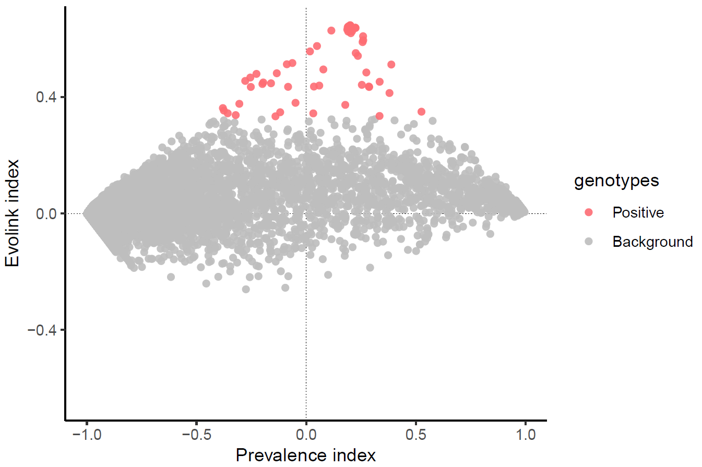
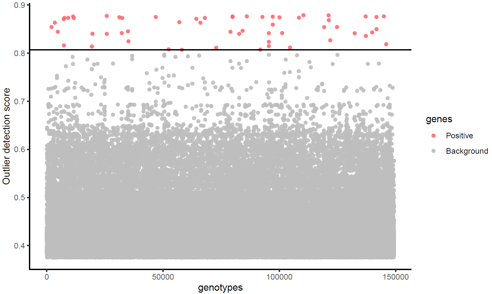
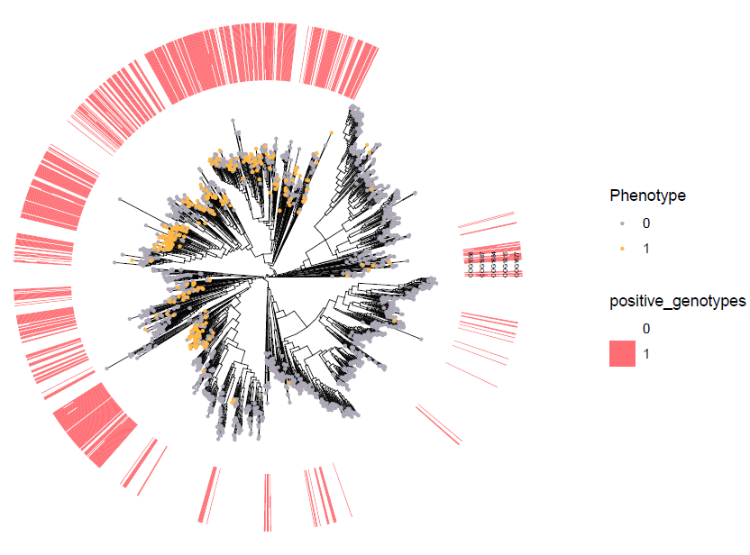

# A walkthrough using flagella data as a use case
This tutorial is a walkthrough tested on Linux system with flagella dataset in the paper to guide users from the very beginning to use Evolink to find flagella-associated genes.

### Prerequist
- [gotree](https://github.com/evolbioinfo/gotree)
- [python >= 3.8.8](https://www.python.org/downloads/release/python-388/)
- Evolink

We prepared essential files in `data/` and `scripts/` folders to help users to obtain essentia inputs for Evolink. 
- `data/WOL_genomes_traits.tsv`: A tab-delimited file containing five columns. They are genome (WOL species-level genome ID), species_tax_id (the NCBI taxonomy ID of the species for the genome), data_source (which database the phenotype is extracting from), gram-stain (the genome is annotated as of gram positive/negative function or not) and motility (the genome is annotated as of motility, flagella function or not). 
- `data/WOL_tree.nwk`: A newick format tree file with all species-level genomes in WOL (https://biocore.github.io/wol/), downloaded from https://biocore.github.io/wol/data/trees/tree.nwk.
- `data/flagella_emapper.og_tsv`: A tab-delimited file containing three columns. They are genome (WOL species-level genome ID), gene (gene ID) and orthogroup (gene family annotated by eggNOG mapper).
- `scripts/og_tsv2pa_table.py`: A custom python to convert `data/flagella_emapper.og_tsv` into an orthogroup presence/absence tab-delimited table.

### Step.1 Prepare tree file
```
# change to work directory
cd flagella_data/
unzip data.zip
mkdir -p tmp

# filter out genomes without motility annotation
awk -F"\t" 'NR>1&&$5!="NA"&&($5=="no"||$5=="flagella"){print $1"\t"$5}' data/WOL_genome_trait.tsv | sort | uniq -c |awk '{print $2"\t"$3"\t"$1}' > tmp/flagella.tsv

# exclude species with some of the genomes having flagella function and others not
cut -f1 tmp/flagella.tsv | sort | uniq -d > tmp/conflict_id.list
awk -F"\t" 'BEGIN{OFS="\t"}NR==FNR{a[$1];next}!($1 in a){print $0}' tmp/conflict_id.list tmp/flagella.tsv | sed "s/flagella/yes/g" > tmp/flagella_clean.tsv

# extract a subtree from the whole WOL species tree by keeping annotated species
gotree prune -r -f <(cut -f1 tmp/flagella_clean.tsv) -i data/WOL_tree.nwk -o tree.nwk
```

Output `tree.nwk`:
```
(((G000212395:0.5179134701,G000020965:0.36415375250000004)N21:0.0598443197,((G000745455:0.3600787193,(G000023325:0.3586068792,...
```

### Step.2 Prepare phenotype file
```
cut -f1-2 tmp/flagella_clean.tsv > tmp/select_tips.list
# get formatted file by defining two columns. 'Tip' is for species ID and 'Status' is 0/1 indicating its having flagella function or not.
awk -F"\t" 'BEGIN{print "Tip\tStatus"}$2=="no"{print $1"\t0"}$2!="no"{print $1"\t1"}' tmp/select_tips.list > trait.tsv
```
Output `trait.tsv` is a two-column file labeling teh phenotypic presence/absence of each species:
```
Tip	Status
G000006605	0
G000006725	0
G000006745	0
G000006845	0
...
G900156525	0
G900156635	1
G900156675	1
```

### Step.3 Prepare genotype file
```
# convert paris of gene IDs and orthogroups into an orthogroup presence/absence tab-delimited table.
SCRIPT=scripts/og_tsv2pa_table.py
gidlist=tmp/flagella_gid.list
cut -f1 tmp/select_tips.list > ${gidlist}
ogtsv=data/flagella_emapper.og_tsv
python ${SCRIPT} -i ${ogtsv} -g ${gidlist} -o tmp/flagella_emapper -b
sed "s/Orthogroup/#OTU ID/g" tmp/flagella_emapper.BiPA.table > gene.tsv
```
Output `gene.tsv` is an orthogroup (row) X species (column) tab-delimited table:
```
#OTU ID	G000006605	G000006725	G000006745	G000006845 ...
31739	0	0	0	0 ...
2ZU9B	0	0	0	0 ...
2ZR82	0	0	0	0 ...
30XZK	0	0	0	0 ...
33BBH	0	0	0	0 ...
31Y0P	0	0	0	0 ...
...
```

### Step.4 run Evolink and generate plots
Note that `gene.tsv`, `trait.tsv`, `tree.nwk` input files can be found in example_input.zip.  
```
# By default, Evolink doesn't plot. To enable visualization, use '-v' option. To overwrite output directory, 
python ../Evolink.py -g gene.tsv -t trait.tsv -n tree.nwk -o Evolink_output_plot -f -v > output.log
```
Output:  
- `Evolink_output_plot/result.tsv`: A tab-delimited table containing five columns, orthoID (orthogroup ID), Prevalence_index, Evolink_index, scores (outlier scores assigned by outlier detection method) and significance (if a gene is significantly associated with flagella. `sig` means significant and `NA` means not).  
```
orthoID	Prevalence_index	Evolink_index	scores	significance
31739	-0.9967731683286393	-0.003226868272581007	0.4118442606086053	NA
2ZU9B	-0.9962721214133531	-0.0037279151878671923	0.41935271739202135	NA
...
COG2200	0.17781539696118348	0.3730548028482333	0.8236068571964368	sig
COG2201	0.25339116923656996	0.44190195695639256	0.8415057770062423	sig
COG2206	0.11469775879646743	0.32334012568460146	0.7965679031848957	NA
COG2207	0.7238556637614044	0.08973408866517651	0.6161632835500714	NA
COG2204	0.5250924943806133	0.3496160815679787	0.8146470234349243	sig
...
```
You can see that Evolink found 57 significantly associated genes. If you look at the Evolik index in detail, you could tell that they are all positively associated.  
```
awk '$5=="sig"' Evolink_output_plot/result.tsv |wc -l
```

The above significantly genes are further visualized in three types of plots.  
- `Evolink_output_plot/Evolink_plot.pdf`


- `Evolink_output_plot/Manhattan_plot.pdf`


- `Evolink_output_plot/Positive_genotypes_ggtree_plot.pdf`
Note that no negatively associated genes are found in this use case, Negative_genotypes_ggtree_plot.pdf is skiped.  


- `Evolink_output_plot/Evolink_itol_input.zip`, `Evolink_output_plot/input.tree`, `Evolink_output_plot/binary.txt`
A tree file (input.tree) and annotation file (binary.txt) as well as a zipped file are provided for users to visualize their results on the [Tree of Life (iTOL)](https://itol.embl.de/).  
a) You can simply upload the `input.tree` to iTOL website and drag `binary.txt` onto the tree page for visualization.  
b) Or if you have a iTOL subscription API key and have installed [iTOL API](https://github.com/iBiology/iTOL), you can use the following command line to upload and annotate your tree.  
`itol Evolink_itol_input.zip -i <your iTOL upload API key> -p <project_name>`

Note that the above output files can be found in example_output.zip.
